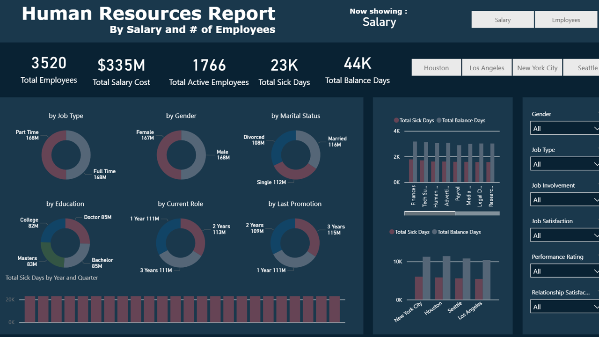
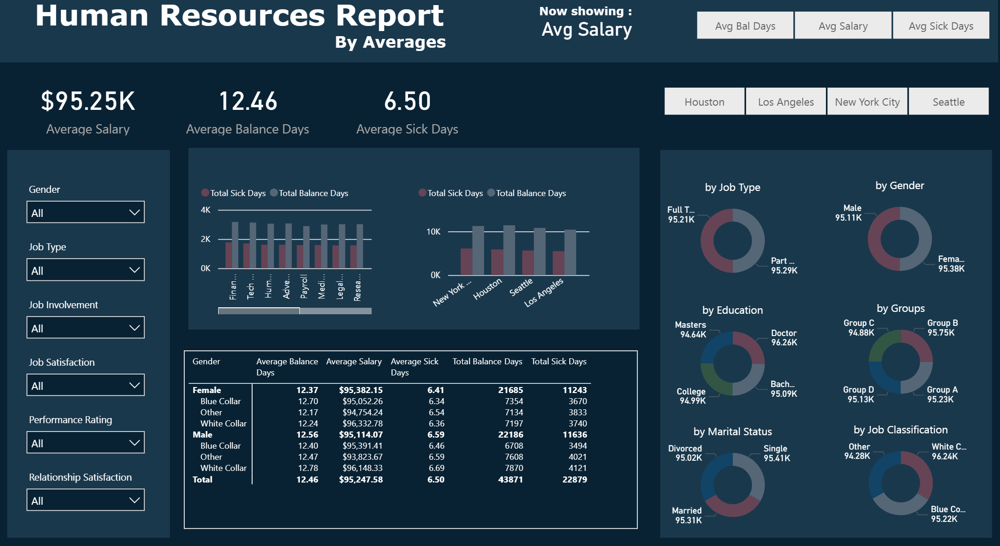
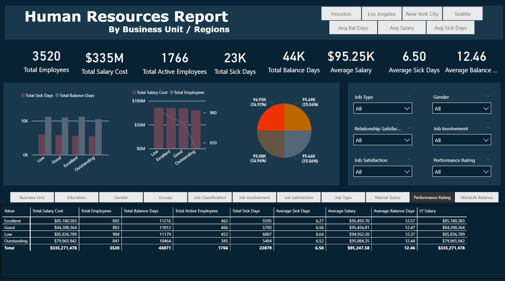

# Human Resources Dashboard 📊

This is a Power BI dashboard I created to help make sense of HR data across different dimensions — things like salary costs, sick days, balance days, and employee breakdowns by gender, job type, education, and more.

It’s broken down into three main views:
- **Salary & Employee Count**
- **Averages (Salary, Sick Days, Balance Days)**
- **Business Unit / Regional Breakdown**

The goal was to build something interactive, visually clean, and genuinely helpful for HR teams or decision-makers who want quick insights into how people are distributed, how much they cost, and what patterns are emerging across the business.

---

## 🖼️ Sneak Peek

|  |

## 📌 What You’ll Find in the Dashboard

Here are some of the key numbers and breakdowns:

- **Total Employees** – 3,520  
- **Total Salary Cost** – $335M  
- **Average Salary** – $95.2K  
- **Total Sick Days** – 23,000  
- **Average Sick Days** – 6.5  
- **Total Balance Days** – 44,000  

You can slice the data by:
- Gender, Job Type, Marital Status, Education Level  
- Time with Company / Last Promotion  
- Performance Rating  
- Business Units (Finance, Tech Support, HR, etc.)  
- Cities (New York, Seattle, Houston, Los Angeles)

There are filters throughout the dashboard, so you can easily change the view based on what you care about most.

More Sneek Peek

---

## ⚙️ Tech & Tools

- Built with **Power BI Desktop**
- Used slicers, DAX measures, donut and bar charts
- Data aggregated across multiple HR-related fields

---

## 👀 Try It Yourself

If you’d like to explore the dashboard or tweak it, just download the `.pbix` file and open it using Power BI Desktop. ---

## 💬 Let’s Connect

If this dashboard inspires you or you’d like to collaborate on something similar, feel free to reach out.

Thanks for checking it out! 😊
